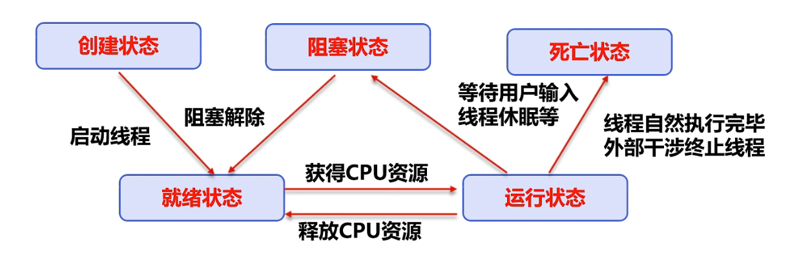
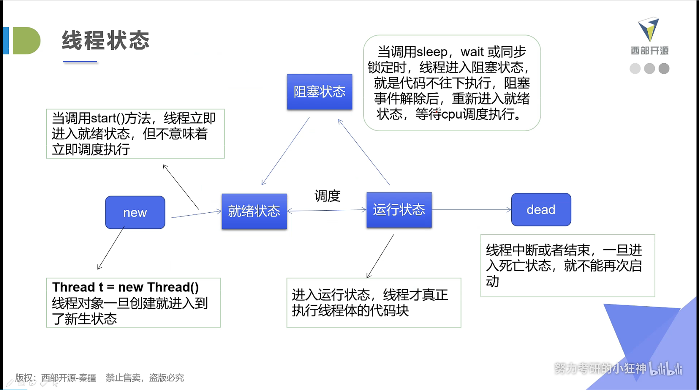
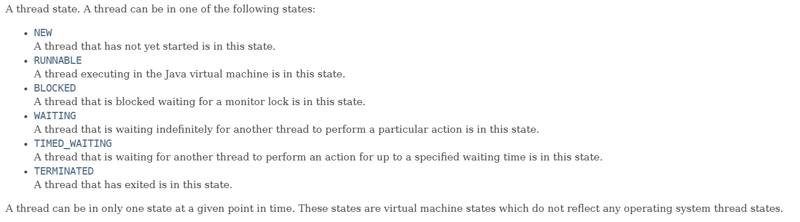

# 0. 目录

本 项目主要讲到的是 java 多线程的 基本内容

 大概包括内容如下:

-   线程介绍
-   **线程实现**
-   线程状态
-   **线程同步**
-   线程通信问题
-   高级主题
    -   线程池, 定时器 等内容

# 1. 线程简介

## 基本概念

进程与线程 -- > process and thread

进程是程序执行一次的执行过程, 他是一个动态的概念, 是系统资源分配的单位

进程中通常含有多个线程, 线程是 cpu 调度和执行的单位

>   注意:
>
>   很多线程是模拟出来的, 真正的多线程是指有多个 cpu, 即多核, 比如服务器.
>
>   如果是模拟出来的 (只有一个 cpu) 那么这样的多线程是通过快速切换线程而模拟出来的.

## 核心概念

-   线程就是独立的执行路径；
-   在程序运行时，即使没有自己创建线程，后台也会有多个线程，如主线程，gC线程；
-   main0称之为主线程，为系统的入口，用于执行整个程序；
-   在一个进程中，如果开辟了多个线程，线程的运行由调度器安排调度，调度器是与操作系统紧密相关的，先后顺序是不能人为的干预的。
-   对同一份资源操作时，会存在资源抢夺的问题，需要加入并发控制：
-   线程会带来额外的开销，如cpu调度时间，并发控制开销。
-   每个线程在自己的工作内存交互，内存控制不当会造成数据不一致

# 2. 线程创建

Thread Runnable Callable

创建线程有三种主要方式:

-   **Thread Class --> 继承 Thread 类 (重点)**
-   **Runnable 接口 --> 实现 Runnable 接口 (重点)**
-   Callable 接口 --> 实现 Callable 接口 (了解)

>   These three methods can all be found in the java api files.

## 2.1. Thread

>   The codes of this part can be found in the class TestThread1 of package `com.tian.demo01`.

>   Thread 类本身已经实现了 Runnable 接口.

1.   自定义线程类继承 Thread.
2.   重写 run() 函数, 编写线程执行体
3.   创建线程对象, 调用 start() 函数

>NOTICE:
>Thread start does not necessarily execute immediately.
>it is scheduled by cpu.

## 2.2. 实现 Runnable 接口 (Recommanded)

>   The codes of this part can be found in the class TestThread2 of package `com.tian.demo01`.

1.   定义 MyRunnable 类实现 Runnable 接口
2.   实现 run() 函数, 编写线程执行体
3.   创建 Thread 对象, 调用 start() 函数启动线程

>   推荐使用 runnable 接口的方式, 因为 java 只支持单继承, 这样可以避免继承方面的局限性
>
>   Runnable-made method to implement multi-thread can make your codes more flexible. (Such as use three Thread instance to start one object that has implemented Runnable interface)

## 2.2-1. 多线程操作同一个数据对象时出现数据紊乱

>   参考代码 `src.com.tian.demo01.TestThread3`

多线程同时操作同一个数据对象时, 由于多个线程轮流处理该数据对象, 而不是排队处理, 所以会导致该数据被某个线程引用时, 已经被另一个线程引用过(但是没有处理完)的情况. 从而导致数据出现紊乱.

## 2.2-2. 多线程案例 -- 龟兔赛跑案例

>   参考代码: `src.com.tian.demo01.Race_Thread.java`.

---

需求:

1.   首先创建赛道, 要求离终点越来越近
2.   判断比赛是否结束
3.   打印出胜利者
4.   龟兔赛跑开始
5.   故事中最终乌龟胜利了, 而兔子在中途睡觉了, 所以现在要模拟兔子睡觉
6.   最终乌龟赢得了比赛

---

## 2.3. 实现 callable 接口(了解)

1.   实现 callable 接口 (需要返回值)
2.   重写 call 方法, 需要抛出异常
3.   创建目标对象
4.   创建执行服务
5.   提交执行
6.   获取结果
7.   关闭服务

---

**使用 callable 的好处在于:** 

callable 可以定义返回值, 可以抛出异常.

## 2.4. 静态代理

>   参考代码: `src.com.tian.demo03_static_proxy.TestStaticProxy.java` 

静态代理可以理解成一种思路.

以结婚为例子, 假设 有 Person 类的 person 对象现在要执行 getMarry() 函数, 但是执行该函数(也就是 person 结婚) 需要执行一些前置或者后置函数 (比如要先输出一段话, 执行结束以后输出第二段话), 而 person 对象本身在同一时间需要执行一些其他函数 (也就是结婚的时候他有其他任务要做)

那么现在可以用一个新的类 (比如婚庆公司 WeddingCompany 类) 来代替 person 执行结婚的函数执行.

那么这个 WeddingCompany 就可以理解成一个代理.

---

而在利用 Runnable 接口实现多线程的时候, 我们有一个这样的语句:

```java
new Thread( myRunnable ).start();
```

显然这里就是 Thread 静态代理了 myRunnable 类对象的函数.

所以说, **Thread 底层的思路模式就是 静态代理 的思想.** 

## 2.5. Lamda 表达式

lamda 表达式本质上是一种函数式编程的概念, 其目的是为了避免匿名内部类定义过多.

lamda 表达式的格式如下:

```text 
(params) -> expression[表达式]
(params) -> statement [语句]
(params) -> { statements }
```

-   为什么使用 lamda 表达式?
    -   避免匿名内部类定义过多
    -   让代码看起来更简洁
    -   可以去掉没有意义的代码, 只留下核心的逻辑

### 2.5-1. 函数式接口 -- 前置知识点

-   理解函数式接口 function interface, 是学习 lamda 表达式的关键.

-   函数式接口的定义:

    -   任何接口, 如果只**包含唯一一个抽象方法**, 那么他就是一个函数式接口.

        ```java
        // Runnable 接口 就是一个函数式接口
        public interface Runnable {
            public static void run();
        }
        ```

    -   对于函数式接口, 我们可以通过 lamda 表达式创建该接口的对象.

### 2.5-2. lamda 表达式的推导和调用

>   参考代码: `com.tian.demo04_lamda_expression.TestLamdaExpr.java`和`com.tian.demo04_lamda_expression.TestLamdaExpr2.java` 两个 java 文件.
>
>   -- 其中, 前者是无参数 lamda 表达式, 后者是有参数的形式.

>   参考代码: `src/com/tian/demo04_lamda_expression/LamdaShow.java` 
>
>   -- 这是 lamda 表达式最终的形式和一些简化方式以及条件.

总结:

1.   lamda 表达式只能在只有一行代码的情况下简化成为一行, 如果有多行代码, 建议用标准方式.

2.   使用前提, 必须是函数式接口 (只有一个函数的接口).

3.   多个参数也可以去掉参数类型, 要去掉就所有参数都去掉, 并且这种情况下必须加括号.

# 3. 五大状态

一个线程的五大状态:





---

相关的方法:

| 方法                         | 说明                                     |
| ---------------------------- | ---------------------------------------- |
| setPriority(int newPriority) | 修改线程的优先级                         |
| sleep(int millions)          | 在指定的毫秒数内令线程休眠               |
| join()                       | 等待该线程终止                           |
| static void yield()          | 暂停当前正在执行的线程, 并且执行其他线程 |
| void interrupt()             | 中断线程 (<u>不建议</u>)                 |
| boolean isAlive()            | 测试线程是否处于活动状态                 |

## 3.1. 停止线程

>   参考代码: `src/com/tian/demo05_states/TestStopThread.java` 

-   不推荐使用 jdk 推荐的 stop() 和 destory() 方法. (已经被废弃)
-   推荐线程自己停止
-   建议用一个标志位进行终止变量, 当 flag == false, 则停止线程.

## 3.2. 线程休眠

>   参考代码: `src/com/tian/demo05_states/TestSleep.java`.

线程休眠使用 sleep() 方法.

-   sleep() 函数指定当前线程阻塞的毫秒数
-   sleep() 存在异常 InterruptedException
-   sleep() 时间结束后线程进入就绪状态
-   sleep() 可以模拟网络延时, 倒计时等.
-   每个对象都有一个锁, 但是 sleep() 不会释放锁

模拟网络延时的主要目的是: **放大问题的发生性**.

## 3.3. 线程礼让 yield

>   代码参考: `src/com/tian/demo05_states/TestYield.java` 

-   礼让线程, 让当前执行的线程暂停, 但是不阻塞进程
-   将线程从运行状态转换成就绪状态
-   **让cpu重新调度, 礼让不一定成功! (看 cpu 心情)** 

## 3.4. 线程强制执行 Join

>   代码参考: `src/com/tian/demo05_states/TestJoin.java` 

-   join() 合并线程, 待此线程执行结束后, 在执行其他进程, 其他线程阻塞

## 3.5. 观察测试线程状态

>   代码参考: `src/com/tian/demo05_states/TestState.java` 

线程状态 Thread.State 类是一个枚举类, 用于表示目标线程目前所属的状态, 下面是 java api 中给出的 Thread.State 的所有枚举项:



## 3.6. 线程优先级

>   参考代码: `src/com/tian/demo05_states/TestPriority.java` 

-   Java 提供了一个线程调度器, 用于监控程序中启动后进入就绪状态的所有线程, 线程调度器按照优先级决定应该调度哪个线程来执行.

-   线程的优先级用数字表示, 范围是 1-10:

    >   线程优先级高, 会使该线程权重加大, 但是仍然不一定最先执行, 这个还是要取决于 cpu 的心情的.

    -   Thread.MIN_PRIORITY = 1
    -   Thread.MAX_PRIORITY = 10
    -   Thread.NORM_PRIORITY = 5

-   使用以下函数改变或者获取线程优先级:

    -   getPriority()
    -   setPriority()

**注意: **<u>*先设置优先级, 在启动线程.*</u> 

## 3.7. 守护线程 daemon

>   参考代码: `` 

-   线程分为 用户线程 和守护线程
-   jvm 必须确保用户线程执行完毕
-   jvm 不必等待守护线程执行结束
-   守护线程常用于 记录后台操作日志, 监控内存, 垃圾回收等 功能.

# 4. 线程同步 --> 多线程同时操作同一个资源

## 4.1. 队列和锁

并发: 同一个线程被多个线程同时操作.

-   处理多线程的时候, 多个线程同时访问同一个对象, 并且某些线程还想要修改这个对象, 这个时候我们就需要线程同步.

    线程同步实际上是一种等待机制, 多个需要同时访问该对象的线程进入这个**对象的等待池**形成队列, 等待前面线程使用完毕, 下一个线程在使用.

线程同步的实现条件: 队列 + 锁.

-   由于同一个进程的多个线程共享同一块存储空间, 在带来方便的同时, 也带来了访问冲突问题, 为了保证数据在函数访问时的正确性, 在访问时加入锁机制, synchronized, 当一个县城获得对象的排他锁, 独占思源, 其他线程必须等待.
    -   一个线程持有锁会导致奇特所有需要此锁的线程被挂起.
    -   在多线程竞争下, 加锁, 释放锁, 会导致比较多的上下文切换和调度延时, 引起性能问题.
    -   如果一个优先级高的线程等待一个优先级低的线程释放锁, 会导致优先级别倒置, 引起性能问题.

## 4.2. 三大不安全案例


## 4.3. 同步方法和同步块

### 4.3.1. 同步方法

-   由于我们可以通过 private 关键字来保证数据对象只能被函数访问, 所以只需要针对函数提出一套机制, 即 synchronized 关键字, 他包含两种用法: synchronized 函数和 synchronized块.
-   synchronized 函数控制对 "对象" 的访问, 每一个对象对应一把锁, 每一个 synchronized 函数都必须获得调用该函数的对象的锁才能进行, 否则线程会阻塞, 函数一旦执行, 就会独占该锁, 直到函数返回才会释放锁, 后面被阻塞的线程才能获得这个锁, 继续执行.

**缺点: 如果将一个函数声明为 synchronized , 将会影响效率**

### 4.3.2. 同步块


